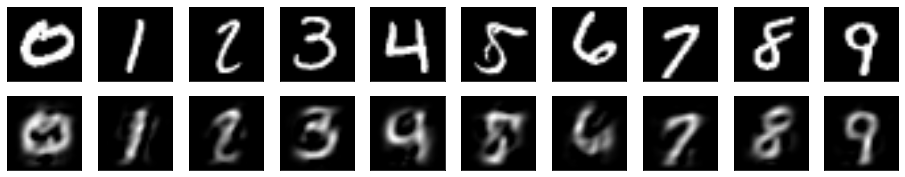
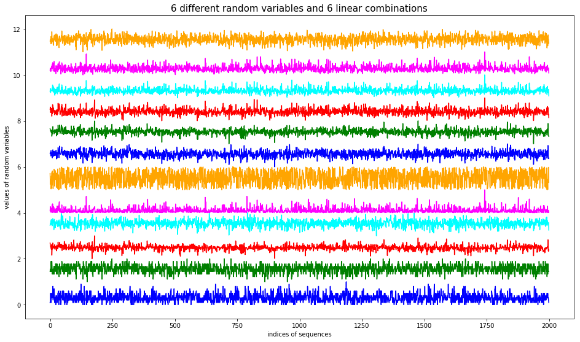
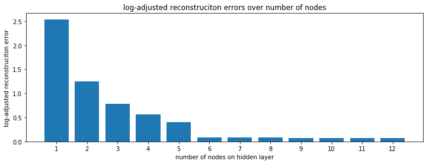
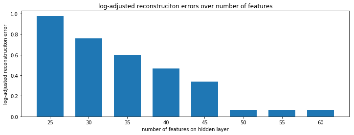
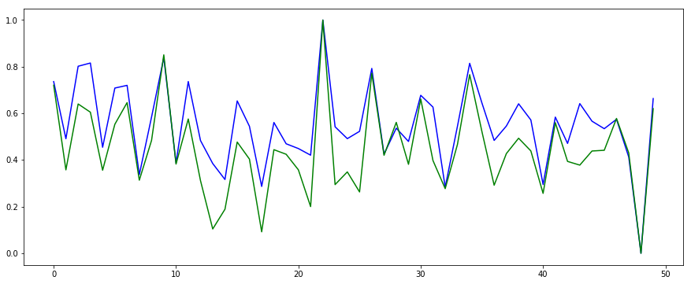
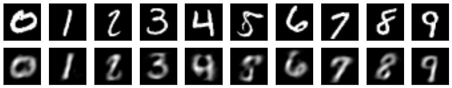
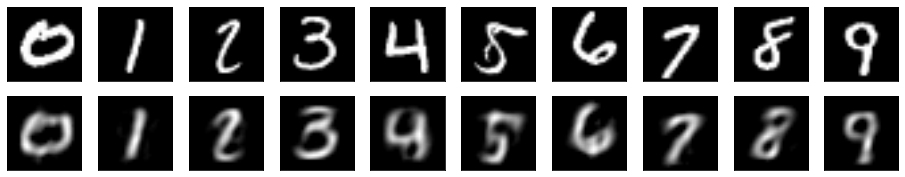

# Data Mapping and Finite Difference Learning

This notebook presents the numerical experiments on the finite difference learning to extend the capability of the traditional restricted Boltzmann machine (RBM) on three aspects:

- Any data type can be used on both visible and hidden layers without a probability
- A finite difference learning procedure is proposed for both undirected and directed graphs
- The activations on both visible and hidden layers can take non-sigmoid functions

More details can be found from the preprint - https://arxiv.org/abs/1909.08210

The descriptions on the numerical experiments are included in the above paper. Both the traditional gradient descent and finite difference learning are included in the Python package.

# Setup the work environment


```python
import os
import numpy as np
import pandas as pd
import scipy.stats as stats

import matplotlib.pyplot as plt

color = ['blue', 'green', 'red', 'cyan', 'magenta', 'orange', 'darkgreen', 'tomato', 'darkblue', 'darkred']

working_dir = 'C:\ML\RBM'
os.chdir(working_dir)
import rbm as rbm
#importlib.reload(rbm)

def plot_result(test, proj, recon, height, width, step, start):
    ## visualize the original and reconstructed image pairs
    fig, axs = plt.subplots(2, 10, sharex=True, sharey=True, figsize=(16, 3))
    axs = axs.flatten()

    ii = start
    kk = 0
    while kk < 10:
        sample = test[kk*step+ii].reshape(28, 28)
        axs[kk].imshow(sample, cmap=plt.cm.gray, interpolation="bilinear")
        axs[kk].xaxis.set_visible(False)
        axs[kk].yaxis.set_visible(False)

        recon1 = recon[kk*step+ii].reshape(28, 28)
        _max = np.max(recon1)
        recon1 = np.clip(recon1, 0, _max)
        axs[kk+10].imshow(recon1, cmap=plt.cm.gray, interpolation="bilinear")
        axs[kk+10].xaxis.set_visible(False)
        axs[kk+10].yaxis.set_visible(False)

        kk += 1

    plt.show()

    # visualize the extracted features
    fig, axs = plt.subplots(1, 10, sharex=True, sharey=True, figsize=(16, 2))
    kk = 0
    while kk < 10:
        proj1 = proj[kk*step+ii].reshape(height, width)
        axs[kk].imshow(proj1, cmap=plt.cm.gray, interpolation="nearest")
        axs[kk].xaxis.set_visible(False)
        axs[kk].yaxis.set_visible(False)

        kk += 1
    plt.show()
```

# Load the training and test dataset


```python
file_image = "C:\ML\RBM\mnist_image.csv"
file_label = "C:\ML\RBM\mnist_label.csv"
mnist_image = pd.read_csv(file_image)
mnist_label = pd.read_csv(file_label)

mnist_image = mnist_image.values
mnist_image = mnist_image/255.0
mnist_label = mnist_label.values.transpose()[0]

mnist_image = mnist_image.astype(np.float64)
mnist_label = mnist_label.astype(np.int32)
```

## Split the total data into training and test datasets
Total 10k samples are used, this section is to split them into 9k for training and 1k for test.


```python
start = 500
end = 600
interval = 1000

image_train = np.concatenate((np.copy(mnist_image[:start]), np.copy(mnist_image[end:interval])))
image_test = np.copy(mnist_image[start:end])
                             
label_train = np.concatenate((np.copy(mnist_label[:start]), np.copy(mnist_label[end:interval])))
label_test = np.copy(mnist_label[start:end])

ii = 1
while ii < 10:
    train1 = np.copy(mnist_image[(ii*interval):(ii*interval+start)])
    train2 = np.copy(mnist_image[(ii*interval+end):((ii+1)*interval)])
    image_train = np.concatenate((image_train, train1, train2))
    image_test = np.concatenate((image_test, np.copy(mnist_image[(ii*interval+start):(ii*interval+end)])))

    label1 = np.copy(mnist_label[(ii*interval):(ii*interval+start)])
    label2 = np.copy(mnist_label[(ii*interval+end):((ii+1)*interval)])
    label_train = np.concatenate((label_train, label1, label2))
    label_test = np.concatenate((label_test, np.copy(mnist_label[(ii*interval+start):(ii*interval+end)])))

    ii += 1

print(image_train.shape)
print(image_test.shape)
```

    (9000, 784)
    (1000, 784)
    

# Linear transform with MNIST

### Specify the network dimension


```python
height = 5
width = 5
recon_len = image_train.shape[1]
proj_len = height*width
lrbm = rbm.LRBM(proj_len, recon_len)
print("weights shape = {0}".format(lrbm.weights.shape))
```

    weights shape = (25, 784)
    

### Train network and process test data

Support continuous training if the results look not satisfactory.


```python
error, recon, proj = lrbm.train(image_train, learn_rate=0.005, epochs=10, batch_size=10, report_freq=2)
#error, recon, proj = lrbm.train(image_train, learn_rate=0.0025, epochs=10, batch_size=10, report_freq=2)

proj = lrbm.proj(image_test)
recon = lrbm.recon(proj)
```

    Epoch 2: 	training error = 0.02396854346642985
    Epoch 4: 	training error = 0.023681324635335916
    Epoch 6: 	training error = 0.023641817919908235
    Epoch 8: 	training error = 0.023614485059778857
    Epoch 10: 	training error = 0.02359834101741093
    

### Visualize the results from test data


```python
step = 100 #(10, 100)
start = 10 #(205, 10)
plot_result(image_test, proj, recon, height, width, step, start)
```





## Linear transform with vector data for dimensionality reduction

### Generate random sequences with colinearity


```python
seq_total = 12
seq_len = 2000
seq_data = np.empty((seq_total, seq_len))
seq_data[0] = np.random.poisson(3.0, seq_len)
seq_data[1] = np.random.binomial(10, 0.6, seq_len)
seq_data[2] = np.random.laplace(-1.0, 1.0, seq_len)
seq_data[3] = np.random.normal(.5, 1.0, seq_len)
seq_data[4] = np.random.exponential(2.0, seq_len)
seq_data[5] = np.random.uniform(-2.0, 2.0, seq_len)

seq_data[6]  = seq_data[0]*0.25+seq_data[1]*0.75+seq_data[2]*0.50
seq_data[7]  = seq_data[1]*0.30+seq_data[2]*0.70+seq_data[3]*0.50
seq_data[8]  = seq_data[2]*0.45+seq_data[3]*0.55+seq_data[4]*0.35
seq_data[9]  = seq_data[3]*0.60+seq_data[4]*0.40+seq_data[5]*0.20
seq_data[10] = seq_data[4]*0.50+seq_data[5]*0.35+seq_data[0]*0.45
seq_data[11] = seq_data[5]*0.40+seq_data[0]*0.10+seq_data[1]*0.60

plt.figure(figsize=(16, 20))
ax = plt.subplot(2, 1, 1)
plt.title('6 different random variables and 6 linear combinations', fontsize=15)
ii = 0
while ii < seq_data.shape[0]:
    seq_data[ii] = stats.zscore(seq_data[ii])
    plt.plot(np.arange(seq_len), rbm.scale_minmax(seq_data[ii])+ii, color[ii%6])
    ii += 1
    
plt.ylabel('values of random variables')
plt.xlabel('indices of sequences')

plt.show()
```





```python
print("The original data shape = {0}".format(seq_data.shape))
seq_samples = []
subseq_len = 50
stride_len = 20

ii = 0
while ii < seq_data.shape[1]-subseq_len:
    seq_samples.append(seq_data[:, ii:(ii+subseq_len)])
    ii += stride_len

seq_samples = np.array(seq_samples, np.float32)
print("The generated sequence of matrices with shape = {0}".format(seq_samples.shape))
```

    The original data shape = (12, 2000)
    The generated sequence of matrices with shape = (98, 12, 50)
    

### Train the network


```python
recon_len = seq_samples.shape[1]
err = []

proj_len = 1
while proj_len <= 12:
    print("number of nodes = {0}".format(proj_len))
    drbm = rbm.DRBM(proj_len, recon_len, subseq_len)
    error, recon, proj = drbm.train(seq_samples, learn_rate=0.01, epochs=100, batch_size=10, report_freq=50)
    err.append(error)
    proj_len += 1
```

    number of nodes = 1
    Epoch 50: 	training error = 0.8222359127151145
    Epoch 100: 	training error = 0.8212657405814905
    number of nodes = 2
    Epoch 50: 	training error = 0.6695822986372912
    Epoch 100: 	training error = 0.6686668339970137
    number of nodes = 3
    Epoch 50: 	training error = 0.5280056080398012
    Epoch 100: 	training error = 0.5273868209693292
    number of nodes = 4
    Epoch 50: 	training error = 0.40738859969434843
    Epoch 100: 	training error = 0.40669290884372916
    number of nodes = 5
    Epoch 50: 	training error = 0.2850385174509733
    Epoch 100: 	training error = 0.28384831603999905
    number of nodes = 6
    Epoch 50: 	training error = 0.004890348547263358
    Epoch 100: 	training error = 0.001603444313694681
    number of nodes = 7
    Epoch 50: 	training error = 0.0037041176303111226
    Epoch 100: 	training error = 0.0015480478100866372
    number of nodes = 8
    Epoch 50: 	training error = 0.0037524069352546747
    Epoch 100: 	training error = 0.0015625048335485164
    number of nodes = 9
    Epoch 50: 	training error = 0.0033067000005795972
    Epoch 100: 	training error = 0.0013402206149870088
    number of nodes = 10
    Epoch 50: 	training error = 0.002886911864871123
    Epoch 100: 	training error = 0.0013380483513586849
    number of nodes = 11
    Epoch 50: 	training error = 0.003335231595308392
    Epoch 100: 	training error = 0.0013356914662151127
    number of nodes = 12
    Epoch 50: 	training error = 0.002646930780551304
    Epoch 100: 	training error = 0.001211806326322039
    

### Relationship between training error and number of nodes


```python
err_log = np.asarray(err, dtype=np.float)
err_log = -1.0/np.log(err_log)
x = np.arange(12)+1

plt.figure(figsize=(12, 4.0))
plt.xlabel('number of nodes on hidden layer')
plt.ylabel('log-adjusted reconstruciton error')
plt.title('log-adjusted reconstruciton errors over number of nodes')
plt.xticks(x, x)
plt.bar(x, err_log)
plt.show()
```





## Linear transform with vector data for feature extraction


```python
err = []

node_len = seq_samples.shape[1]
recon_len = seq_samples.shape[2]
proj_len = 25
while proj_len <= 60:
    print("number of features = {0}".format(proj_len))

    frbm = rbm.FRBM(proj_len, recon_len, node_len)   
    error, recon, proj = frbm.train(seq_samples, learn_rate=0.005, epochs=100, batch_size=10, report_freq=20)
    
    err.append(error)
    proj_len += 5
```

    number of features = 25
    Epoch 20: 	training error = 0.6030334512573181
    Epoch 40: 	training error = 0.6013488711838277
    Epoch 60: 	training error = 0.6006843766456404
    Epoch 80: 	training error = 0.6002334429903059
    Epoch 100: 	training error = 0.5998963135604605
    number of features = 30
    Epoch 20: 	training error = 0.5227935818393984
    Epoch 40: 	training error = 0.5202501021487893
    Epoch 60: 	training error = 0.5195181732001609
    Epoch 80: 	training error = 0.519159860891905
    Epoch 100: 	training error = 0.518891111615846
    number of features = 35
    Epoch 20: 	training error = 0.4385147006067684
    Epoch 40: 	training error = 0.4359852555133861
    Epoch 60: 	training error = 0.43531344704877883
    Epoch 80: 	training error = 0.43500682806268653
    Epoch 100: 	training error = 0.43479333680572063
    number of features = 40
    Epoch 20: 	training error = 0.3467423412489361
    Epoch 40: 	training error = 0.3422611183467167
    Epoch 60: 	training error = 0.34127933288723944
    Epoch 80: 	training error = 0.34097931980724877
    Epoch 100: 	training error = 0.34079440311951364
    number of features = 45
    Epoch 20: 	training error = 0.23513148502027142
    Epoch 40: 	training error = 0.23109505981639233
    Epoch 60: 	training error = 0.23029328068177507
    Epoch 80: 	training error = 0.2300572653177954
    Epoch 100: 	training error = 0.2299299480357725
    number of features = 50
    Epoch 20: 	training error = 0.0007826995664677197
    Epoch 40: 	training error = 0.0006639757949912413
    Epoch 60: 	training error = 0.0005618350456914121
    Epoch 80: 	training error = 0.0004739014690593678
    Epoch 100: 	training error = 0.0003981602347881919
    number of features = 55
    Epoch 20: 	training error = 0.0006991062445761994
    Epoch 40: 	training error = 0.0005937730193972368
    Epoch 60: 	training error = 0.0005034159267637503
    Epoch 80: 	training error = 0.0004258664952424862
    Epoch 100: 	training error = 0.00035928444032857603
    number of features = 60
    Epoch 20: 	training error = 0.0006339782839187113
    Epoch 40: 	training error = 0.0005389903898295354
    Epoch 60: 	training error = 0.0004576139096574181
    Epoch 80: 	training error = 0.00038787129970390354
    Epoch 100: 	training error = 0.0003280848290429982
    


```python
x = (25, 30, 35, 40, 45, 50, 55, 60)

plt.figure(figsize=(12, 4.0))
plt.xlabel('number of features on hidden layer')
plt.ylabel('log-adjusted reconstruciton error')
plt.title('log-adjusted reconstruciton errors over number of features')
plt.xticks(x, x)

err_log = np.asarray(err, dtype=np.float)
err_log = -1.0/np.log(err_log)
plt.bar(x, err_log, width = 3.5)
plt.show()
```





### Visualize the difference between the original image and reconstructed image from features


```python
print(seq_samples.shape)
node_len = seq_samples.shape[1]
recon_len = seq_samples.shape[2]
proj_len = 25

frbm = rbm.FRBM(proj_len, recon_len, node_len)
```

    (98, 12, 50)
    


```python
error, recon, proj = frbm.train(seq_samples, learn_rate=0.005, epochs=100, batch_size=10, report_freq=20)
```

    Epoch 20: 	training error = 0.604150888552192
    Epoch 40: 	training error = 0.6014059659297641
    Epoch 60: 	training error = 0.6006447059196884
    Epoch 80: 	training error = 0.6001988770288127
    Epoch 100: 	training error = 0.5998821286279858
    


```python
kk = 20
ii = 6
plt.figure(figsize=(15, 6.0))
plt.plot(np.arange(recon_len), rbm.scale_minmax(seq_samples[kk][ii]), color[0])
plt.plot(np.arange(recon_len), rbm.scale_minmax(recon[kk][ii]), color[1])
plt.show()
```





# Non-linear transform with flexible activations

### RBM


```python
height = 5
width = 5
recon_len = image_train.shape[1]
proj_len = height*width
crbm = rbm.CRBM(proj_len, recon_len, act_proj='softsign', act_recon='relu')
print(crbm.weights.shape)
```

    (25, 784)
    


```python
error, recon, proj = crbm.train(image_train, learn_rate=0.0025, learner='fd',epochs=20, batch_size=10, report_freq=4)

proj = crbm.proj(image_test)
recon = crbm.recon(proj)
```

    Epoch 4: 	training error = 0.22189648101240436
    Epoch 8: 	training error = 0.19274171882536856
    Epoch 12: 	training error = 0.18196700324362783
    Epoch 16: 	training error = 0.17577358730619744
    Epoch 20: 	training error = 0.17216679329741538
    


```python
step = 100 # (10, 100)
start = 10 # (205, 10)
plot_result(image_test, proj, recon, height, width, step, start)
```





## DBM - deep representation


```python
height = 5
width = 5
recon_len0 = image_train.shape[1]
recon_len1 = 784
recon_len2 = 196
recon_len3 = height*width
crbm0 = rbm.CRBM(recon_len1, recon_len0, act_proj='softsign', act_recon='relu')
crbm1 = rbm.CRBM(recon_len2, recon_len1, act_proj='softsign', act_recon='identity')
crbm2 = rbm.CRBM(recon_len3, recon_len2, act_proj='softsign', act_recon='identity')

dbm = rbm.CDBM()
dbm.add(crbm0)
dbm.add(crbm1)
dbm.add(crbm2)
```


```python
dbm.pretrain(image_train, learn_rate=0.02, learner='gd',epochs=20, batch_size=20, report_freq=5)
dbm.pretrain(image_train, learn_rate=0.01, learner='fd',epochs=20, batch_size=20, report_freq=5)
```

    Current layer = 1
    Epoch 5: 	training error = 0.04960105936618011
    Epoch 10: 	training error = 0.04158094868423426
    Epoch 15: 	training error = 0.037432287768552445
    Epoch 20: 	training error = 0.03468812027225948
    Current layer = 2
    Epoch 5: 	training error = 0.07364022409607697
    Epoch 10: 	training error = 0.0659240931336294
    Epoch 15: 	training error = 0.062474976974649564
    Epoch 20: 	training error = 0.06053368705055785
    Current layer = 3
    Epoch 5: 	training error = 0.18620324267603647
    Epoch 10: 	training error = 0.18374725323217014
    Epoch 15: 	training error = 0.18223899272684269
    Epoch 20: 	training error = 0.18086248033687297
    Current layer = 1
    Epoch 5: 	training error = 0.03145782945958944
    Epoch 10: 	training error = 0.030267194245812538
    Epoch 15: 	training error = 0.029300174180597573
    Epoch 20: 	training error = 0.028466628447229702
    Current layer = 2
    Epoch 5: 	training error = 0.060429799600874766
    Epoch 10: 	training error = 0.05995068724450223
    Epoch 15: 	training error = 0.05955923825556236
    Epoch 20: 	training error = 0.05921983267691664
    Current layer = 3
    Epoch 5: 	training error = 0.17660203664896296
    Epoch 10: 	training error = 0.17626840064107496
    Epoch 15: 	training error = 0.17602298333294963
    Epoch 20: 	training error = 0.17581177941027298
    


```python
#err = dbm.train(image_train, learn_rate=0.01, epochs=6, batch_size=10, report_freq=2)
err = dbm.train(image_train, learn_rate=0.0025, epochs=6, batch_size=10, report_freq=2)

proj = dbm.proj(image_test)
recon = dbm.recon(proj)
```

    Epoch 2: 	training error = 0.15566890077563802
    Epoch 4: 	training error = 0.1554852722980231
    Epoch 6: 	training error = 0.1553496361247897
    


```python
step = 100 # (100, 10)
start = 10 # (10, 205)
plot_result(image_test, proj, recon, height, width, step, start)
```





```python

```
